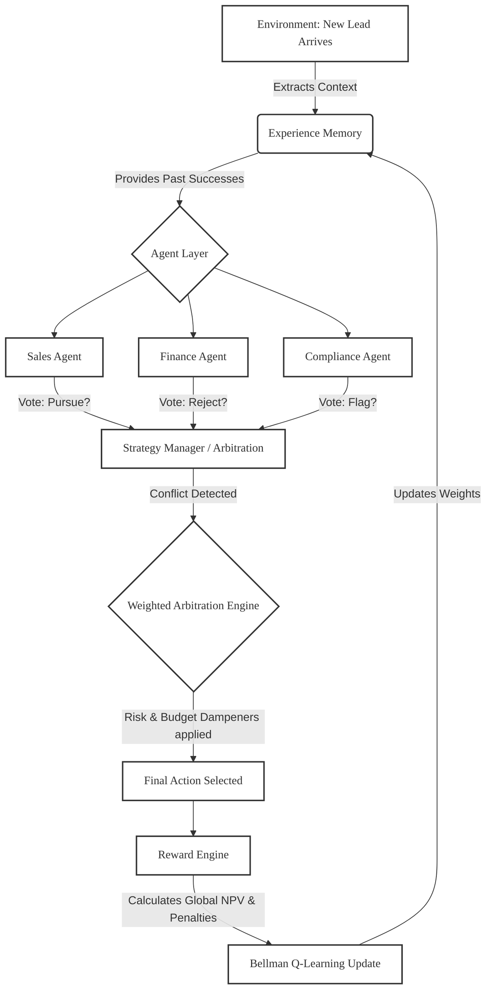

# 🧠 System Architecture: Multi-Agent SalesOps

This document outlines the core flow, agent interactions, and arbitration logic of the system in a simple, whiteboard-style format.

## 1. High-Level Flow Diagram

---

## 2. Agent Interaction Logic

The system is built on **Competing Local Incentives**:

*   **Sales Agent:** Looks at `deal_value` and `urgency`. It will almost always recommend `pursue_lead` or `offer_discount` to maximize revenue, ignoring costs.
*   **Finance Agent:** Looks at `acquisition_cost` and `budget_remaining`. It will recommend `reject_lead` or `nurture_lead` if the margin is too thin or the company is running out of money.
*   **Compliance Agent:** Looks at `risk_score` and `compliance_flags`. It acts as a shield, recommending `request_more_info` or `notify_compliance` to prevent catastrophic enterprise fines.

Instead of one AI trying to balance all three (which leads to mediocre, average decisions), the agents **argue their extreme positions**.

---

## 3. Arbitration (The Conflict Resolver)

When the agents submit different actions, the **Arbitration Engine** steps in.

1.  **Confidence Scoring:** Each agent submits a confidence score (0.0 to 1.0) along with their vote.
2.  **Role Weighting:** By default, Sales might have a 1.2x weight, but this is dynamic.
3.  **Economy-Aware Dampeners:**
    *   *If `risk_score > 0.65`:* The Arbitration Engine automatically dampens the weight of the Sales agent's vote to prevent dangerous deals.
    *   *If `budget_remaining < 20%`:* The Arbitration Engine exponentially dampens expensive actions, forcing the Finance agent's conservative vote to win.
4.  **Final Output:** The action with the highest weighted mathematical score wins, and the reasoning is logged for explainability.
